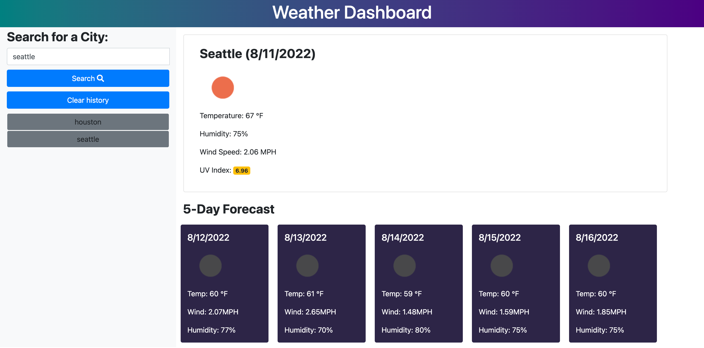

# turbo-weather
This website allows users to be able to check current and future weather forecasts in multiple cities. OpenWeather API was used to pull information related to the forecast. Once a user loads the page, a search engine appears. Once a user searches by city name, the current weather conditions, temperature, humidity, UV index, windspeed appear. Additionally, a five day forecast with the same information appears below. All searches are saved in local storage and displayed on the page. Users can also clear their search history. 

# Screenshot

# Links
Git Hub Repo Link: https://github.com/hasnafar/turbo-weather
Deployed URL: https://hasnafar.github.io/turbo-weather/